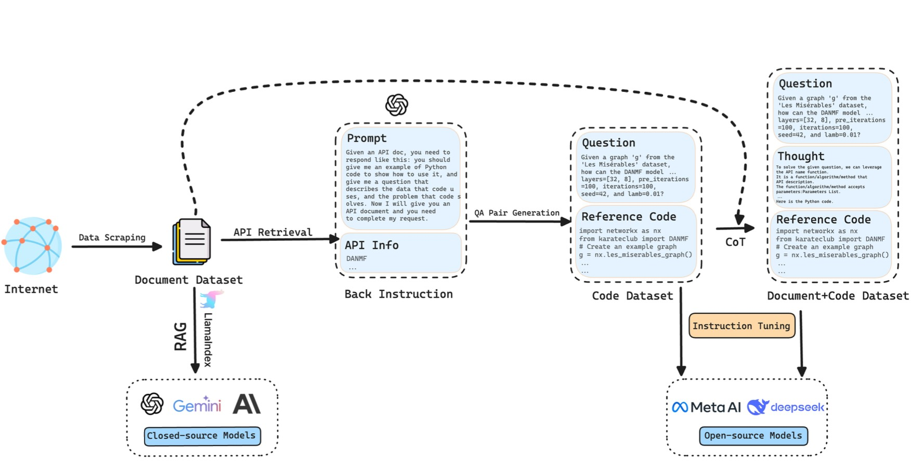

<!-- 




 -->

Hi~, I am Xin Li [ɕɪnˉ liˇ] (李鑫). My research interest includes natrual language processing, large language model, autonomous agent. I have published several papers at the top international AI Conferences / Journals with total . If you are interested in my work or potential collaboration, please feel free to reach out to me at lixin4sky[at]gmail.com.(please replace [at] with @).

# 🔥 News
- *2024.09*: &nbsp;🎉🎉 My first paper is accepted by NeurIPS 2024.

- *2024.09*: &nbsp;🎉🎉 I became a Ph.D. Student at Beijing University of Posts and Telecommunications, supervised by Prof. Cheng Yang.

# 📖 Educations
- *2024.09 - Present*, Doctoral student at School of Computer Science, Beijing University of Posts and Telecommunications (BUPT), supervised by Prof. [Cheng Yang(杨成)(BUPT)](https://scholar.google.com/citations?user=OlLjVUcAAAAJ), advised by Prof. [Chuan Shi(石川)(BUPT)](https://scholar.google.com/citations?user=tUq_v90AAAAJ) and Prof. [Zhiyuan Liu(刘知远)(THU)](https://scholar.google.com/citations?user=dT0v5u0AAAAJ).
- *2020.09 - 2024.06*, Undergraduate, China University of Petroleum (Beijing) at Karamay.

# 💻 Internships
- *2024.02 - Present*, [THUNLP](https://nlp.csai.tsinghua.edu.cn), advised by Dr. [Weize Chen(陈暐泽)](https://scholar.google.com/citations?hl=en&user=0CoGHtIAAAAJ) and Dr. [Chen Qian(钱忱)](https://scholar.google.com/citations?user=Rnsawl0AAAAJ), Beijing.

# 📝 Publications 

NeurIPS 2024

<!-- 

CVPR 2016

 -->

[(ProGraph) Can Large Language Models Analyze Graphs like Professionals? A Benchmark, Datasets and Models](https://arxiv.org/abs/2409.19667)

**Xin Li\***, Weize Chen\*, Qizhi Chu, Haopeng Li, Zhaojun Sun, Ran Li, Chen Qian, Yiwei Wei, Zhiyuan Liu, Chuan Shi, Maosong Sun, Cheng Yang†

<!-- [**Source Code**](https://github.com/BUPT-GAMMA/ProGraph) -->

[**Models and Datasets**](https://huggingface.co/lixin4sky/ProGraph)

## ⌛️ Preprints

<!-- 

arxiv preprint

 -->

<!-- 

<video controls width="100%">
  <source src="videos/graphteam/demo1.mp4" type="video/mp4">
  Your browser does not support the video tag.
</video>

arxiv preprint

 -->

  

    <video 
      controls 
      width="100%" 
      poster="images/papers/graphteam_figure.png"
      playsinline 
      preload="metadata"
    >
      <source src="videos/graphteam/demo1.mp4" type="video/mp4">
      Your browser does not support the video tag.
    </video>
    

arxiv preprint

  

  

<!-- 

 -->

[GraphTeam: Facilitating Large Language Model-based Graph Analysis via Multi-Agent Collaboration](https://arxiv.org/abs/2410.18032)

**Xin Li\***, Qizhi Chu\*, Yubin Chen\*, Yang Liu, Yaoqi Liu, Zekai Yu, Weize Chen, Chen Qian, Chuan Shi, Cheng Yang†

<!-- [**Project**](https://github.com/BUPT-GAMMA/GraphTeam) -->

<!-- 下面需要修改成自己的内容 -->

[**Demo**](http://112.124.25.134/gt/): **You can play it!**

- arxiv preprint 
[Scalable autoregressive image generation with mamba](https://arxiv.org/abs/2408.12245)
Haopeng Li, Jinyue Yang, Kexin Wang, Xuerui Qiu, Yuhong Chou, Xin Li, Guoqi Li   
<!-- [**Source Code**](https://github.com/hp-l33/AiM) -->

# 🎖 Honors and Awards
- *2023.10* National Scholarship(Undergraduate)(Top 1%)
- *2021.10* National Scholarship(Undergraduate)(Top 1%)

# 📑 Academic Services

- Reviewer for Conferences: NeurIPS 2024, WWW 2025.

<!-- # 💬 Invited Talks -->

